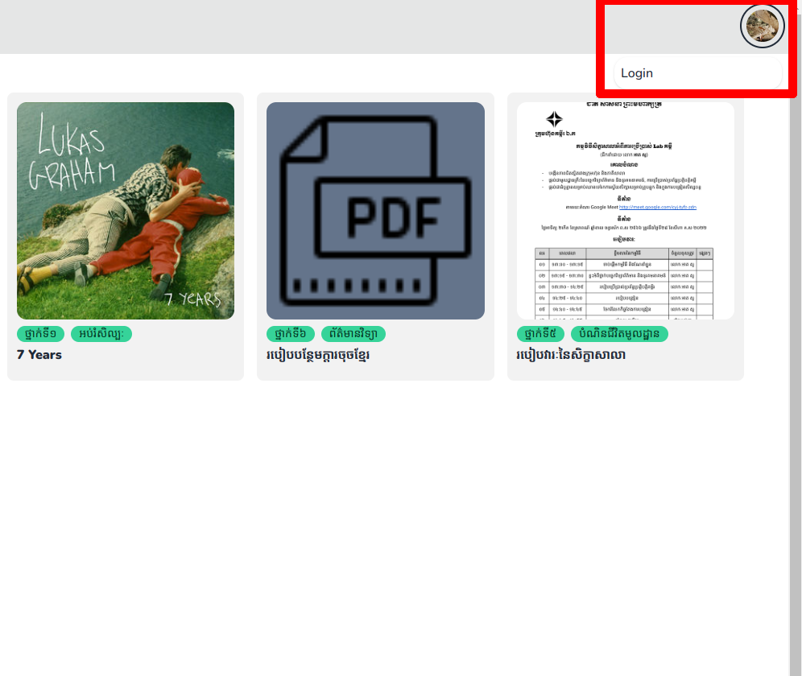
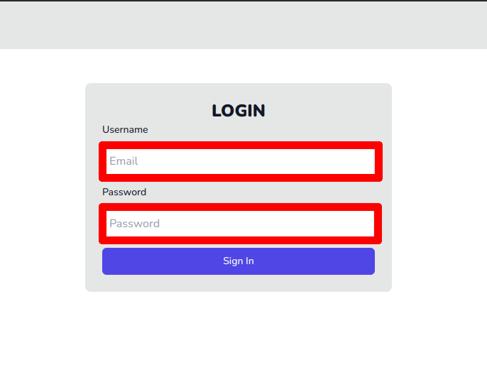
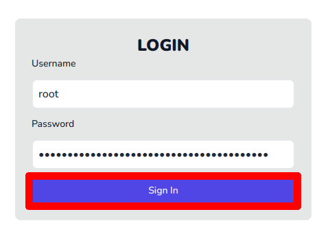
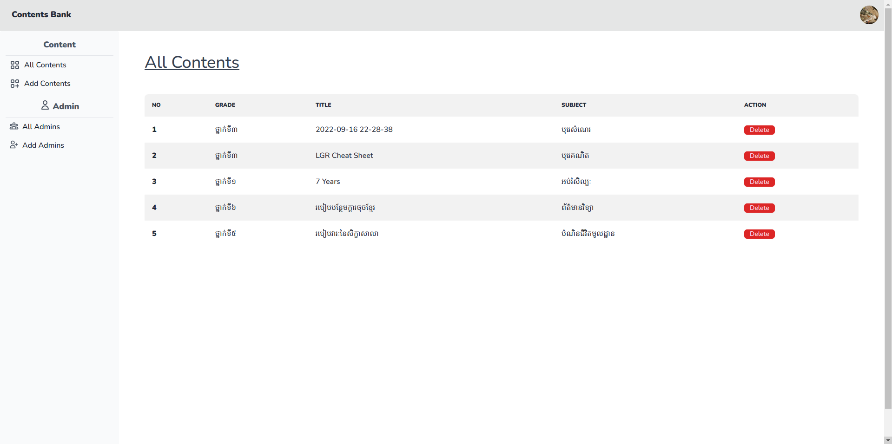

# របៀបក្នុងការផ្ទៀងផ្ទាត់ចូលគ្រប់គ្រង ឬ Login

## ជំហានទី១៖ ចូលទៅកាន់គេហទំព័រដើម 

ដើម្បីចូលទៅកាន់គេហទំព័រដើម សូមពិនិត្យ[ទីនេះ](../usage/first-step.md)

## ជំហានទី២៖ ស្វែងរក និងចុចប៉ូតុងផ្ទៀងផ្ទាត់ចូលគ្រប់គ្រង ឬ Login

## ជំហានទី២៖ បញ្ចូលឈ្មោះអ្នកប្រើប្រាស់ និងលេខកូដសម្ងាត់ផ្ទៀងផ្ទាត់ចូលគ្រប់គ្រង

**ចំណាំ** សម្រាប់ការចូលផ្ទៀងផ្ទាត់ដំបូង សូមទាក់ទងទៅកាន់បុគ្គលិកគម្ពីរ ដើម្បីទទួលបានឈ្មោះអ្នកប្រើប្រាស់ និងលេខកូដសម្ងាត់

## ជំហានទី៣៖ ចុចប៉ូតុងផ្ទៀងផ្ទាត់ចូលគ្រប់គ្រង

## លទ្ធផល

