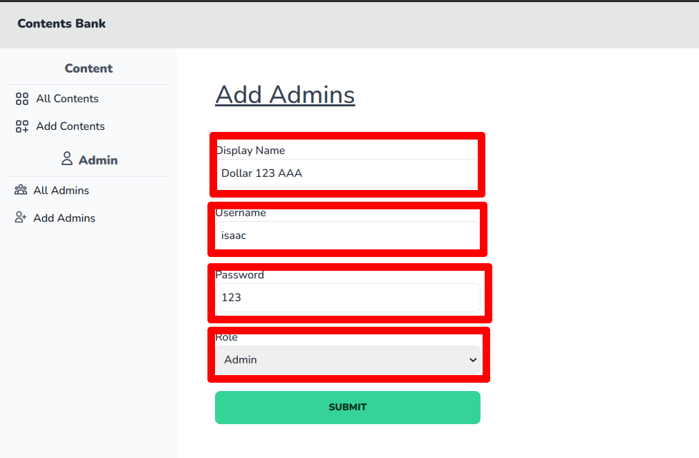

# របៀបក្នុងការបន្ថែមរដ្ឋបាល

## ជំហានទី១៖ ចូលទៅផ្ទៀងផ្ទាត់ចូលគ្រប់គ្រង ឬ Login

ដើម្បីចូលទៅកាន់គេហទំព័រដើម្បីផ្ទៀងផ្ទាត់ចូលគ្រប់គ្រង ឬ Login សូមពិនិត្យ[ទីនេះ](../login/README.md)

## ជំហានទី២៖ ចុចលើប៉ូតុង Add Admin នៅលើផ្ទាំងខាងឆ្វេង

## ជំហានទី៣៖ បំពេញព៌ត៌មានអំពីរដ្ឋបាល

**ប្រអប់លេខ១** គឺសម្រាប់ដាក់ឈ្មោះពេញរបស់រដ្ឋបាល

**ប្រអប់លេខ២** គឺសម្រាប់ដាក់ឈ្មោះចូលផ្ទៀងផ្ទាត់ចូលប្រើប្រាស់ ឬ Login របស់រដ្ឋបាល (ហាមការដាក់ដកឃ្លា និងស្ទួននឹងរដ្ឋបាលផ្សេង)

**ប្រអប់លេខ៣** គឺសម្រាប់ដាក់លេខកូដសម្ងាត់របស់រដ្ឋបាល

**ប្រអប់លេខ៤** គឺសម្រាប់មុខងារ ឬ Role របស់រដ្ឋបាលនោះ (Role ជា Admin មានសិទ្ធត្រឹមគ្រប់គ្រងមាតិកា រីឯ Role ជា Root មានសិទ្ធអាចគ្រប់គ្រងបានគ្រប់យ៉ាង)

## ជំហានទី៤៖ ចុចប៉ូតុង Submit

## លទ្ធផល

យើងនឹងឃើញមានរដ្ឋបាលថ្មីនៅទំព័ររដ្ឋបាលសរុបនៅក្នុងផ្ទាំងគ្រប់គ្រង់។​ យើងក៏អាចយក Username នឹង Password របស់គាត់មកធ្វើការផ្ទៀងផ្ទាត់ចូលគ្រប់គ្រង់ ឬ Login បានដែរ។ 

**ចំណាំ** ដើម្បីចូលទៅកាន់ទំព័ររដ្ឋបាលសរុបនៅក្នុងផ្ទាំងគ្រប់គ្រង់ សូមពិនិត្យ[ទីនេះ](all-admin.md)