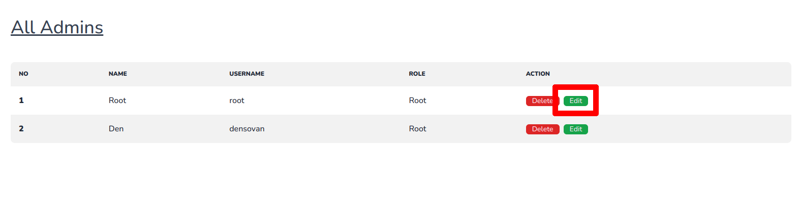

# របៀបក្នុងការលុបរដ្ឋបាល

## ជំហានទី១៖ ចូលទៅផ្ទៀងផ្ទាត់ចូលគ្រប់គ្រង ឬ Login

ដើម្បីចូលទៅកាន់គេហទំព័រដើម្បីផ្ទៀងផ្ទាត់ចូលគ្រប់គ្រង ឬ Login សូមពិនិត្យ[ទីនេះ](../login/README.md)

## ជំហានទី២៖ ស្វែងរក និងចុចប៉ូតុង Delete នៅខាងចុងនៃរដ្ឋបាលដែលអ្នកចង់លុប

## លទ្ធផល

យើងនឹងឃើញមានបាត់រដ្ឋបាលនោះនៅទំព័ររដ្ឋបាលសរុបនៅក្នុងផ្ទាំងគ្រប់គ្រង់

**ចំណាំ** ដើម្បីចូលទៅកាន់ទំព័ររដ្ឋបាលសរុបនៅក្នុងផ្ទាំងគ្រប់គ្រង់ សូមពិនិត្យ[ទីនេះ](all-admin.md)