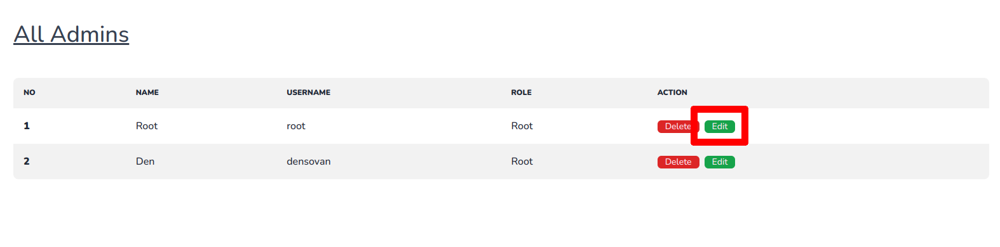
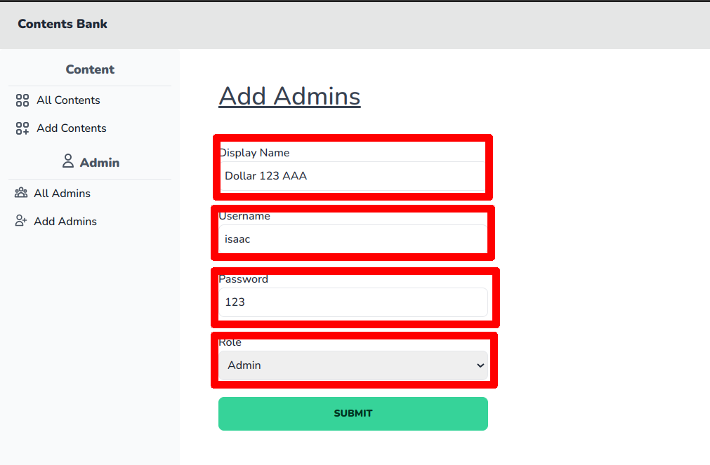
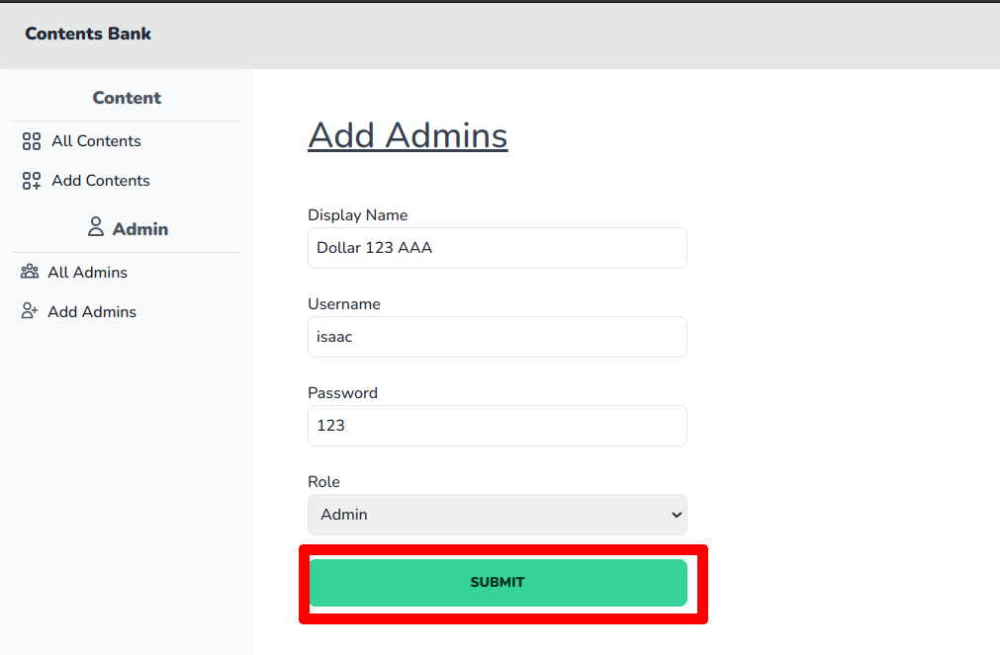
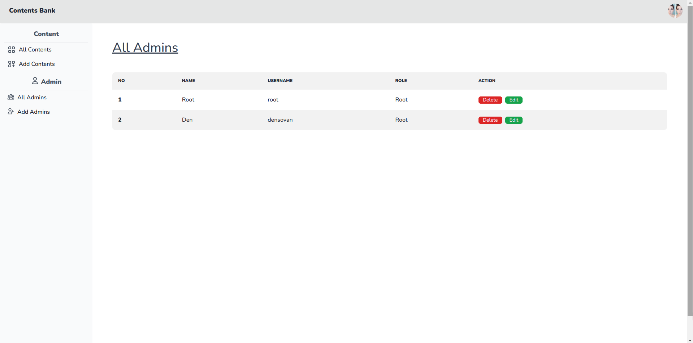

# របៀបក្នុងការកែប្រែព័ត៌មានរដ្ឋបាល

## ជំហានទី១៖ ចូលទៅផ្ទៀងផ្ទាត់ចូលគ្រប់គ្រង ឬ Login

ដើម្បីចូលទៅកាន់គេហទំព័រដើម្បីផ្ទៀងផ្ទាត់ចូលគ្រប់គ្រង ឬ Login សូមពិនិត្យ[ទីនេះ](../login/README.md)

## ជំហានទី២៖ ស្វែងរក និងចុចប៉ូតុង Edit នៅខាងចុងនៃរដ្ឋបាលដែលអ្នកចង់កែប្រែ

## ជំហានទី៣៖ បំពេញព៌ត៌មានអំពីរដ្ឋបាល

## ជំហានទី៤៖ ចុចប៉ូតុង Submit

## លទ្ធផល

យើងនឹងឃើញមានព៌ត៌មានថ្មីរបស់រដ្ឋបាលនោះនៅទំព័ររដ្ឋបាលសរុបនៅក្នុងផ្ទាំងគ្រប់គ្រង់

**ចំណាំ** ដើម្បីចូលទៅកាន់ទំព័ររដ្ឋបាលសរុបនៅក្នុងផ្ទាំងគ្រប់គ្រង់ សូមពិនិត្យ[ទីនេះ](all-admin.md)