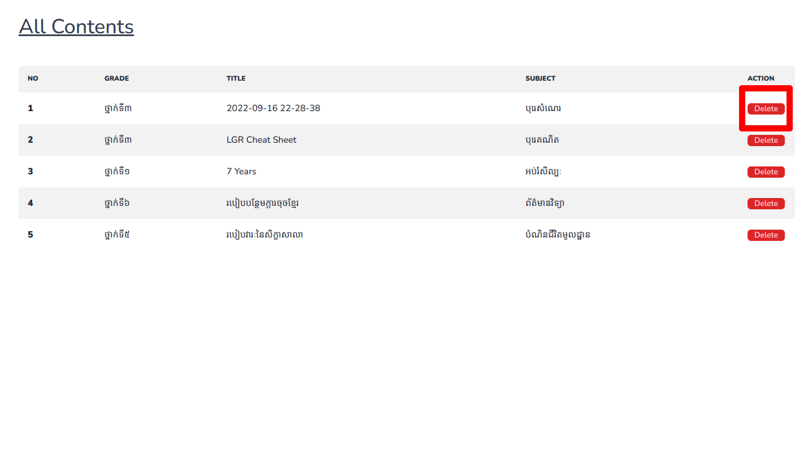

# របៀបក្នុងការលុបមាតិកា

## ជំហានទី១៖ ចូលទៅផ្ទៀងផ្ទាត់ចូលគ្រប់គ្រង ឬ Login

ដើម្បីចូលទៅកាន់គេហទំព័រដើម្បីផ្ទៀងផ្ទាត់ចូលគ្រប់គ្រង ឬ Login សូមពិនិត្យ[ទីនេះ](../login/README.md)

## ជំហានទី២៖ ស្វែងរក និងចុចប៉ូតុង Delete នៅខាងចុងនៃមាតិកាដែលអ្នកចង់លុប

## លទ្ធផល

យើងនឹងឃើញបាត់មាតិកានោះនៅទំព័រមាតិកាសរុបនៅក្នុងផ្ទាំងគ្រប់គ្រង់

**ចំណាំ** ដើម្បីចូលទៅកាន់ទំព័រមាតិកាសរុបនៅក្នុងផ្ទាំងគ្រប់គ្រង់ សូមពិនិត្យ[ទីនេះ](front-dash-page.md#របៀបក្នុងបង្ហាញមាតិកាសរុបនៅក្នុងផ្ទាំងគ្រប់គ្រង់-ពីកន្លែងផ្សេងនៅលើផ្ទាំងគ្រប់គ្រង)