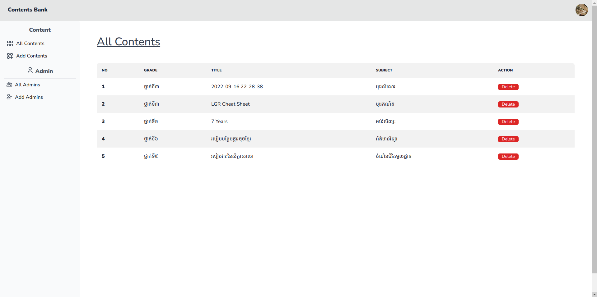
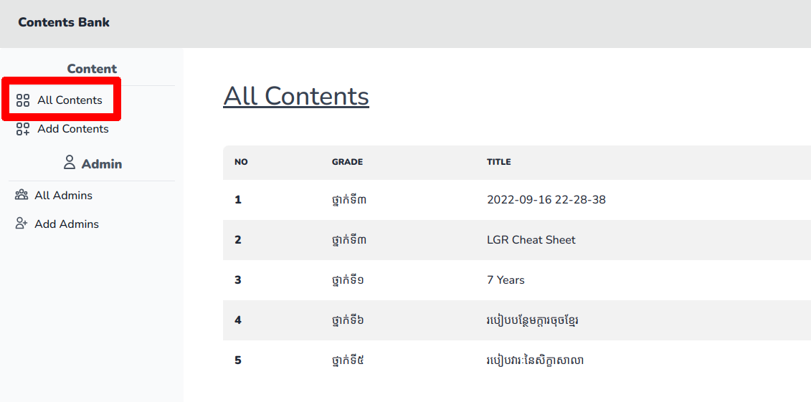

# របៀបក្នុងបង្ហាញមាតិកាសរុបនៅក្នុងផ្ទាំងគ្រប់គ្រង់

## ជំហានទី១៖ ចូលទៅផ្ទៀងផ្ទាត់ចូលគ្រប់គ្រង ឬ Login

ដើម្បីចូលទៅកាន់គេហទំព័រដើម្បីផ្ទៀងផ្ទាត់ចូលគ្រប់គ្រង ឬ Login សូមពិនិត្យ[ទីនេះ](../login/README.md)

## លទ្ធផល

# របៀបក្នុងបង្ហាញមាតិកាសរុបនៅក្នុងផ្ទាំងគ្រប់គ្រង់ ពីកន្លែងផ្សេងនៅលើផ្ទាំងគ្រប់គ្រង

## ជំហានទី១៖ ចុចលើប៉ូតុង All Contents នៅលើផ្ទាំងខាងឆ្វេង

## លទ្ធផល

