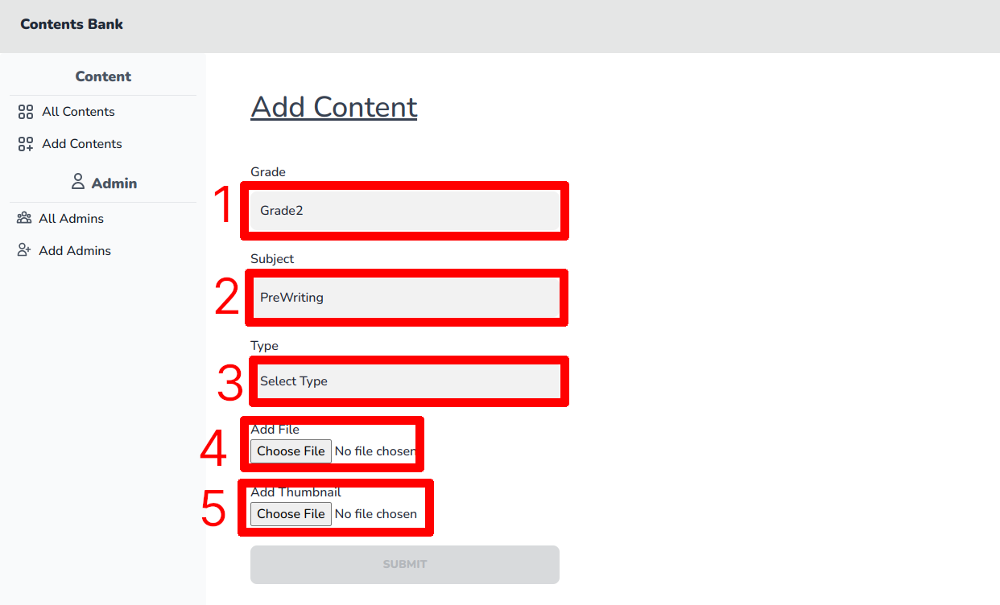
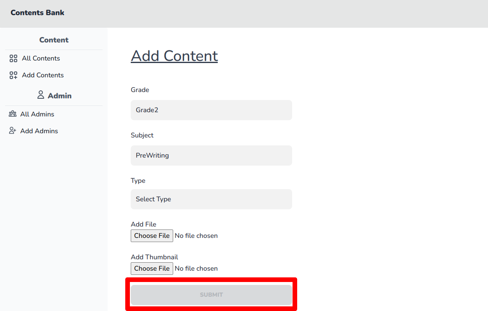
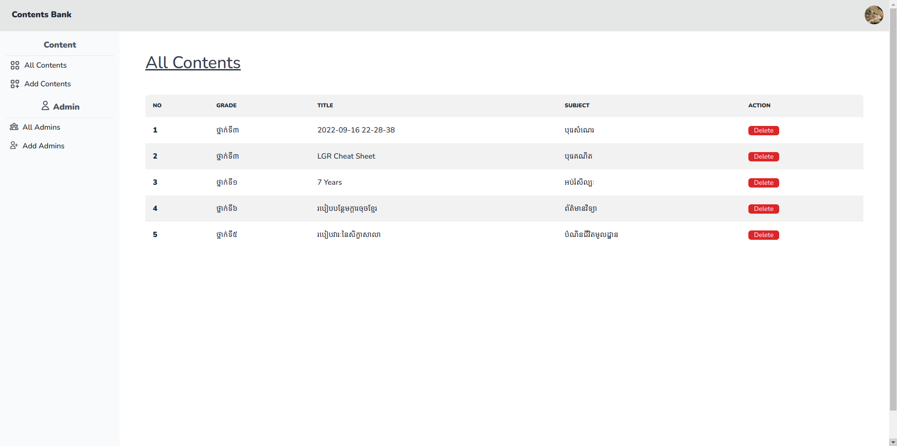

# របៀបក្នុងការបន្ថែមមាតិកា

## ជំហានទី១៖ ចូលទៅផ្ទៀងផ្ទាត់ចូលគ្រប់គ្រង ឬ Login

ដើម្បីចូលទៅកាន់គេហទំព័រដើម្បីផ្ទៀងផ្ទាត់ចូលគ្រប់គ្រង ឬ Login សូមពិនិត្យ[ទីនេះ](../login/README.md)

## ជំហានទី២៖ ចុចលើប៉ូតុង Add Content

## ជំហានទី៣៖ បំពេញព៌ត៌មានអំពីមាតិកា

**ប្រអប់លេខ១** សម្រាប់បំពេញថ្នាក់ទី ដែលមានពីថ្នាក់ទី ១ ដល់់ ៦

**ប្រអប់លេខ២** សម្រាប់បំពេញមុខវិជ្ជា ដែលមានកំណត់តាមកម្រិត។ ឧទាហរណ៍៖ 
- ចិត្តចលភាព ឬ MindMotion
- បុរេគណិត ឬ PreMath
- បុរេសំណេរ ឬ PreWriting
- វិទ្យាសាស្រ្ត ឬ Science
- សង្គម ឬ Science
Social
- អប់រំសិល្បៈ ឬ Art
- អប់រំកាយនិងកីឡា ឬ PE
- ភាសាបារាំង ឬ French
- ភាសាអង់គ្លេស ឬ English
- ព័ត៌មានវិទ្យា​ ឬ ICT
- បំណិនជីវិតមូលដ្ឋាន ឬ BasicPL

**ប្រអប់លេខ៣** សម្រាប់បំពេញប្រភេទនៃមាតិកា ដែលមានជា PDF, សម្លេង និងវីដេអូ

**ប្រអប់លេខ៤** សម្រាប់ដាក់បញ្ចូលឯកសារនោះ (**ចំណាំ៖** សូមធ្វើការកែប្រែឈ្មោះឯកសារនោះអោយបានត្រឹមត្រូវមុនពេលបញូល ព្រោះឈ្មោះនោះនឹងត្រូវដាក់ជាឈ្មោះបង្ហាញនៅលើមាតិកា)

**ប្រអប់លេខ៥** សម្រាប់ដាក់បញ្ចូលរូបតំណាងរបស់ឯកសារនោះ

## ជំហានទី៤៖ ចុចប៉ូតុង Submit

## លទ្ធផល

យើងនឹងឃើញមានមាតិកាថ្មីនៅទំព័រមាតិកាសរុបនៅក្នុងផ្ទាំងគ្រប់គ្រង់

**ចំណាំ** ដើម្បីចូលទៅកាន់ទំព័រមាតិកាសរុបនៅក្នុងផ្ទាំងគ្រប់គ្រង់ សូមពិនិត្យ[ទីនេះ](front-dash-page.md#របៀបក្នុងបង្ហាញមាតិកាសរុបនៅក្នុងផ្ទាំងគ្រប់គ្រង់-ពីកន្លែងផ្សេងនៅលើផ្ទាំងគ្រប់គ្រង)