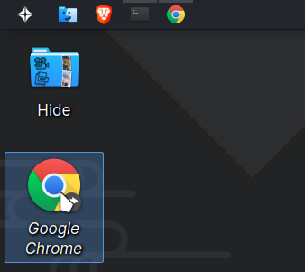
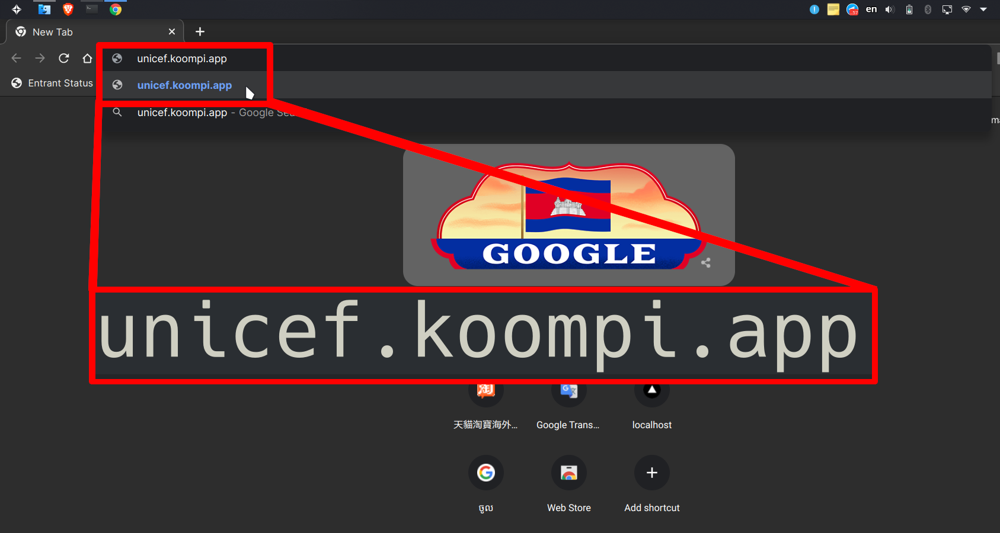
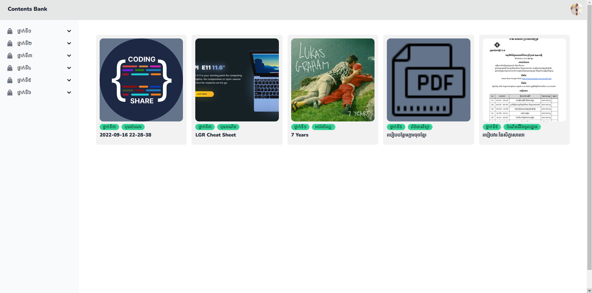

# របៀបចូលទៅកាន់គេហទំព័រដើម

## ជំហានទី១៖ ស្វែងរក និងបើកកម្មវិធីរុករក (Web Browser)

ឧទាហរណ៍កម្មវិធីរុករក ឬ Web Browser មាន 
- Google Chrome
- Mozilla Firefox
- Opera
- Brave
- Microsoft Edge
- ឬកម្មវិធីណាដែលពឹងផ្អែកលើម៉ាស៊ីនបង្ហាញ Gecko ឬ Blink ឬ V8

## ជំហានទី២៖ វាយតំណរ និងចុចបញ្ចូន

**ចំណាំ** តំណរ ឬ Link នៅក្នុងរូបភាព ក្នុងរង្វង់ក្រហម

## លទ្ធផល

