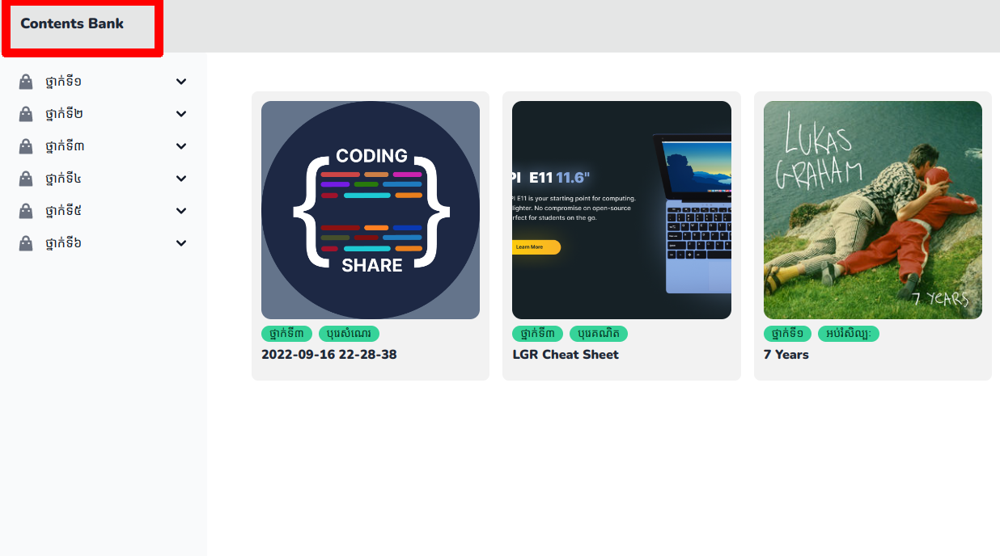

# របៀបក្នុងបង្ហាញមាតិកាសរុប

## ជំហានទី១៖ ចូលទៅកាន់គេហទំព័រដើម 

ដើម្បីចូលទៅកាន់គេហទំព័រដើម សូមពិនិត្យ[ទីនេះ](first-step.md)

## លទ្ធផល

# របៀបក្នុងបង្ហាញមាតិកាសរុប ត្រឡប់មកពីកន្លែងផ្សេង

## ជំហានទី១៖ ចុចលើអក្សរ Content Bank ដូចដែលបានបង្ហាញនៅក្នុងរូប ក្នុងរង្វង់ក្រហម

## លទ្ធផល

