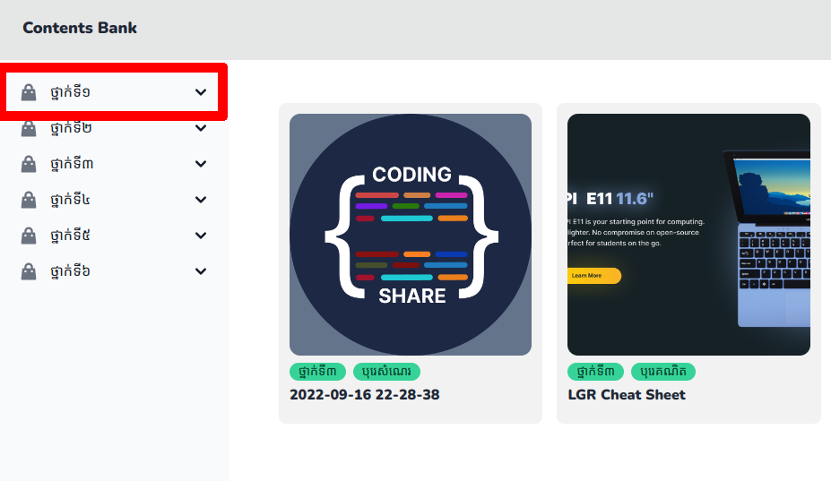
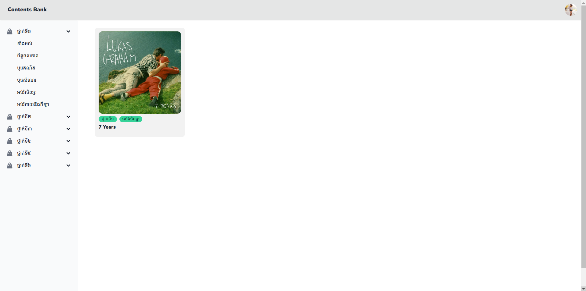

# របៀបក្នុងបង្ហាញមាតិកាដោយថ្នាក់

## ជំហានទី១៖ ចូលទៅកាន់គេហទំព័រដើម 

ដើម្បីចូលទៅកាន់គេហទំព័រដើម សូមពិនិត្យ[ទីនេះ](first-step.md)

## ជំហានទី២៖ ចុចលើអក្សរថ្នាក់ 

## ជំហានទី៣៖ រើសយក ទាំងអស់

## លទ្ធផល

