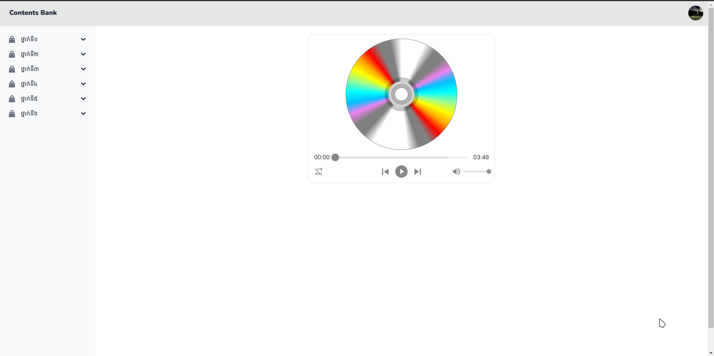

# របៀបក្នុងប្រើប្រាស់មាតិកា

## ជំហានទី១៖ ចូលទៅកាន់គេហទំព័រដើម 

ដើម្បីចូលទៅកាន់គេហទំព័រដើម សូមពិនិត្យ[ទីនេះ](first-step.md)

## ជំហានទី២៖ អូសកណ្ដុរ ទៅចុចលើកណ្ដាលរូបតំណាងចូល នៃរូបទំណាងមាតិកានោះ

## លទ្ធផល

